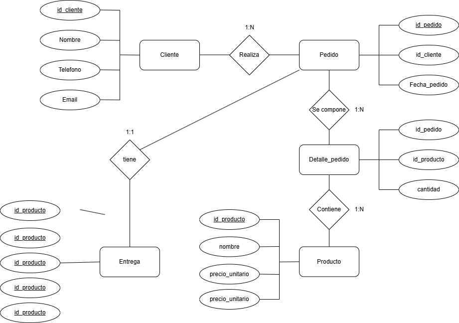

# 🍪 JustBakes DataBase 🍪

Esta base de datos tiene como objetivo ayudar a una tienda de __cookies caseras__ con la organización de:
- **Pedidos**
- **Clientes**
- **Productos**
- **Entregas**
  
También permite registrar qué productos pide **cada cliente, cuándo lo pidió, si ya fue entregado, y cuánto costó.** 

Otra función útil es que se puede **analizar**: 
- **Qué producto tiene un mayor índice de venta**
- **Qué clientes compran más seguido**
- **Cómo mejorar la logística**

## 📋 TABLAS CREADAS 📋
_A continuación están las tablas presentes en la base de datos:_

### CLIENTES
- `id_cliente` (PK)
- `nombre`
- `teléfono`
- `email`

### PRODUCTOS
- `id_producto` (PK)
- `nombre`
- `precio_unitario`
- `stock_disponible`

### PEDIDOS
- `id_pedido` (PK)
- `id_cliente` (FK)
- `fecha_pedido`
- `estado`

### DETALLE_PEDIDO
- `id_detalle` (PK)
- `id_pedido` (FK)
- `id_producto` (FK)
- `cantidad`

### ENTREGAS
- `id_entrega` (PK)
- `id_pedido` (FK)
- `fecha_entrega`
- `dirección_entrega`
- `método_entrega`

## 🗃️ Modelo Relacional 🗃️

Las **relaciones** entre las tablas son las siguientes:

- **Un cliente puede tener muchos pedidos (1:N)**
- **Un pedido puede tener varios productos --> se modela con Detalle_pedido (N:M)**
- **Cada pedido puede tener una única entrega (1:1)**

## 📈 Diagrama Entidad - Relación 📉

